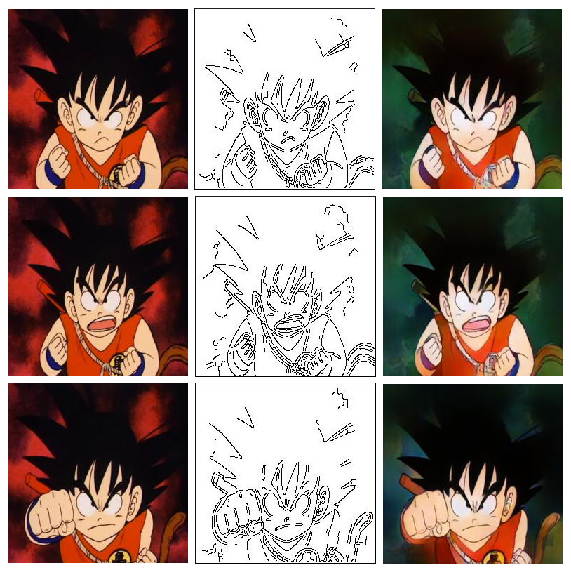
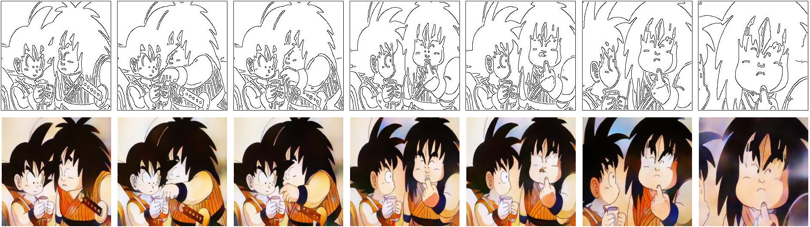

## TCVC: Temporally Coherent Video Colorization
[ArXiv](https://arxiv.org/abs/1904.09527) | [BibTex](#citation)

### Introduction:
We develop a new approach to automatically colorize line art/greyscale anime episode frames to a temporally coherent video using an end-to-end GAN based learning framework. In the animation industry, heavy workloads and overtime are the norm for young artists. When between 3000 to 10000 frames need to be individually animated for a single episode, the work needs to be distributed and outsourced which leads to slow turn around. This method is our initial foray at producing an algorithm that could benefit animation studios and reduce workloads. We mimic lineart using Canny edge detection and adapt a training scheme to preserve temporal information between generated frames to mitigate the flicker effect that exists when using GANs to generate individual frames for video. Detailed information of our work can be found in our [paper](https://arxiv.org/abs/1904.09527).

<p align='center'>  
  
</p>

(Left) Ground truth colored frames. (Middle) Computed sythetic linearts. Edges drawn in black are computed using Canny edge detector. (Right) Colored frame prediction produced by generator.

<p align='center'>  
  
</p>

## Prerequisites
- Python 3
- PyTorch 1.0
- NVIDIA GPU + CUDA cuDNN

## Installation
- Clone this repo:
```bash
git clone https://github.com/harry-thasarathan/TCVC.git
cd TCVC
```
- Install PyTorch and dependencies from http://pytorch.org
- Install python requirements:
```bash
pip install -r requirements.txt
```
### Dataset:
In order to train our automatic video colorization network for anime, we generate a dataset of 60k frames from about 8 episodes of season 1 of the original Dragonball TV show obtained from legal sources. To do so we wrote a script [FrameExtraction.py]('FrameExtraction.py') in which a path to the video file and output folder for the extracted frames can be specified.
```bash
python FrameExtraction.py --video_path [video path] --output_path [output path]
```

### Training
To train the model, place the dataset folder in the same folder of your repository which will be used as the root path during training and testing. Run the following in terminal to begin the training process. Checkpoints are saved every epoch by default and samples are produced in the root directory every 250 iterations. Refer to the argument parser in [Train.py]('Train.py') for more configurability options. 
```bash
python train.py \
  --root [path to root directory (location of repo)] \
  --dataset [name of dataset folder in root directory] \
  --logfile [name of logfile to be generated to keep track of losses] \
  --checkpoint_path_G [loading a pretrained generator] \
  --checkpoint_path_D [loading a pretrained discriminator] \
  --batchSize [size of batch] \
```
